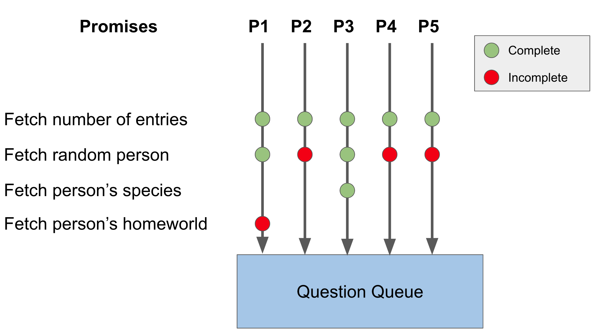
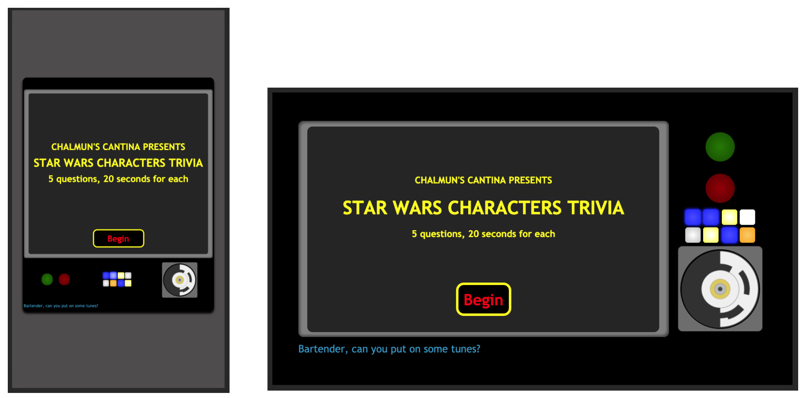
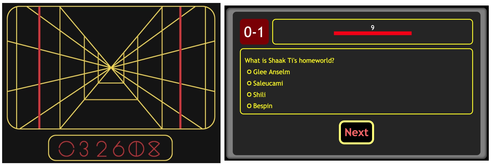

# Star Wars Characters Trivia
### Check out the website [here](https://happy-curran-8b2efc.netlify.app/)!

## Intro
Prior to this project, I primarily worked with React, and I wanted to take a step back to gain a greater appreciation for vanilla JavaScript. I came up with the idea to create a Star Wars trivia game when searching for public API's that I could use to practice fetching data with JS promises. I discovered [SWAPI](https://swapi.dev/), which provided all sorts of data pertaining to the Star Wars universe, including info like what year a certain character was born or what planet they were from. I thought, "Hey, this info could make for a great trivia game!". 

## Details
Although the scope of the project is relatively small, I learned a great deal from this experience. It made me consider the user's perspective when playing the game. How can I reduce the time that a player must wait for data to be fetched from SWAPI? What happens if someone wants to play on their laptop while another wants to play on their phone? How can I immerse them in an experience that makes them feel for a moment that they have been teleported to the world of Star Wars? All of these questions bring up various technical subjects, such as asynchronous programming, responsive web design, and UX decisions. I will briefly cover the major design decisions that were made in creating this application. 

### Creating a Variety of Questions
I wanted the game to generate a random set of questions using templates (or question types) I would create. I ended up implementing three templates: "What year was ____ born?", "What is ____'s homeworld?", and "What species is ____?". It is up to the application to not only randomly select one of these templates but also randomly fetch characters from the server to complete the template. 

For example, the app may decide to ask a birth year question as one of the five questions that are asked in a trivia round. It then proceeds to randomly fetch a character from SWAPI and ends up selecting Luke Skywalker. At this point, it gets the birth year of Luke (19 BBY), finalizes the question to be "What year was Luke Skywalker born?", and creates alternative answer choices to go with the question (using a random birth year generator I wrote). 

With the availability of three question templates and SWAPI's database of roughly 80 characters, the trivia app is able to generate as many as 240 unique questions. 

### Reducing Loading Times for the User
One of my earliest concerns with the project was how to fetch all of the data I needed without causing significant loading times. Each question that the game generates requires a couple fetch calls to be made to SWAPI. Back to the Luke Skywalker example, the app first makes a call to the server to determine how many entries exist in its `people` endpoint. This provides the total number of characters to choose from so that we can avoid errors for accessing data outside of this range. 

Once the app knows the total number of people, it makes a second fetch call in order to randomly select one of the entries, which are represented as JavaScript objects. Depending on the question being asked, a third fetch may be needed. For instance, the species property of a character is stored as a URL to the `species` endpoint of SWAPI. 

```
// Below are some of the properties stored in a person object from SWAPI 
{
    birth_year: "19BBY",
    eye_color: "blue",
    gender: "male",
    hair_color: "blond",
    height: "172",
    homeworld: "https://swapi.py4e.com/api/planets/1/",
    mass: "77",
    name: "Luke Skywalker",
    species: ["https://swapi.py4e.com/api/species/1/"]
}
```


Since the app asks a total of five questions, that could mean as many as 15 separate fetch calls must be made for a single round of trivia. It would not be ideal to have a user wait for all fetches to complete before making the first question available. This is where promises become extremely useful. When a player visits the trivia website, I want the app to kick off multiple question-creating promises in parallel. In addition, when one of these promises resolves with a question returned, it should be made immediately available to the user to view. 

I decided to implement a queue that questions could be stored in as they were generated. Once a question is placed in the queue, the user is free to begin playing the game while any other unresolved promises continue to generate questions in the background. 

<figure>
    
    <figcaption>Diagram showing how questions are added to the queue. In this example, the question generated by the third promise (P3) will be the first added to the queue.</figcaption>
</figure>

The figure above shows five promises that are invoked upon loading the website. Each promise will work to generate a question, whether it's species, birth year, or homeworld related. Whichever promise resolves first will return an object containing a question, its correct answer, and alternative answer choices. In the example above, the third promise resolves first, and therefore its returned object will be the first added to the queue. The question will then be retrieved from the queue and displayed on screen if the user has started the quiz.

### Making the Website Responsive
I wanted to make sure that this application could be enjoyed on a variety of devices, be it in portrait or landscape mode. To achieve this, I researched on responsive web design and implemented techniques like media queries to change the layout of the app based on viewport size and orientation. Another important point was making sure that the proporations of elements remained consistent even as the viewport changes size. The strategy I used was to base the font size of the html element on the width of the viewport. Then, if I wanted an element to scale with the viewport, I set its size using `rem` units, which change depend on the font size of the html element. Chrome Developer Tools was extremely helpful in testing my responsive design because it offers an environment to simulate the app on different mobile devices. 


<figure>
    
    <figcaption>Left. Moto G4 screen in portrait mode. Right. Galaxy S5 in landscape mode.</figcaption>
</figure>

### Further Optimizations
Chrome Dev Tools also provides Lighthouse, which is handy for grading the overall performance of a website. It showed that my application was particularly slow at completing the Largest Contentful Paint, which is a metric for how long it takes for the page to load completely. I was certain the main contributor to this issue was the number of JS files that needed to be downloaded by the browser. This turned into a perfect opportunity to learn about Webpack, which could bundle all of my script files into a single one. I also went a step further and integrated Babel into the build process so that my code could be transpiled to ES5 and thus enhance cross-browser support. 

After bundling my files with Webpack and re-running Lighthouse, the time duration for the Largest Contentful Paint decreased by roughly 230% and my app's overall performance score jumped from 84% to 98%!

### Keeping the Codebase Easily Maintainable
I want to touch on code maintainability because, although it is not something that is unique to my project, tackling it was an eye-opening experience for me. One of the aspects I love about React is that it naturally makes code modular. Components help keep certain parts of the application isolated from one another because they often manage their own state. It is also easy to break up logic such that some components focus on managing state while others focus on presentation. 

As I continued working on the Star Wars project, I became increasingly aware that I would need to take more initiative to achieve a separation of concerns in my codebase. It was becoming more difficult to locate certain pieces of logic, and I was starting to feel less comfortable writing unit tests as the codebase grew. After some research, I learned about the Model View Controller design pattern, which could help to organize my project. 

Once I refactored my code to utilize the MVC architecture, I was pleased with the results. It was so much easier to know exactly where I was updating the DOM versus where I was manipulating or storing data. The same benefits applied to unit tests, where DOM-related tests now occupied their own files. 

As a next step, I would consider using multiple MVC's in my project. By doing so, I could break up the code into React-like components that handle their own data, business logic, and DOM elements related to a particular piece of the website (e.g. the score board, question and answer choice area, etc). 

### Creating an Immersive Experience
I grew up watching Star Wars, and I had a particular love for the originals. I wanted to incorporate themes from the movies into my trivia game in order to give a nostalgic feel. The interface is inspired by the "targeting computers" used on spacecrafts like the X-Wing Starfighter. I also incorporated a combination of CSS animations and the use of requestAnimationFrame in order to create a seamless, engaging user experience. 

<figure>
    
    <figcaption>Left. Star Wars targeting computer. Right. Trivia quiz interface</figcaption>
</figure>

## Conclusion
Through the Star Wars trivia game, I learned concepts that are important in creating user-engaging experiences. This includes leveraging promises to parallelize operations and reduce loading times, adding media queries and utilizing `rem` units to improve responsiveness, and taking advance of tools like Webpack to enhance performance. In addition, maintaining my codebase through refactors and unit tests helped me to add new features with relative ease and with confidence that I was not introducing breaking changes. 

Despite the wealth of knowledge I gained from this project, I know that my design is far from perfect and that there is always room for improvement. I like to think that I am a lifelong Padawan of software engineering always looking to grow. I hope you will enjoy my trivia game and even try for that perfect score (there's a little surprise in store for you if you do). 
